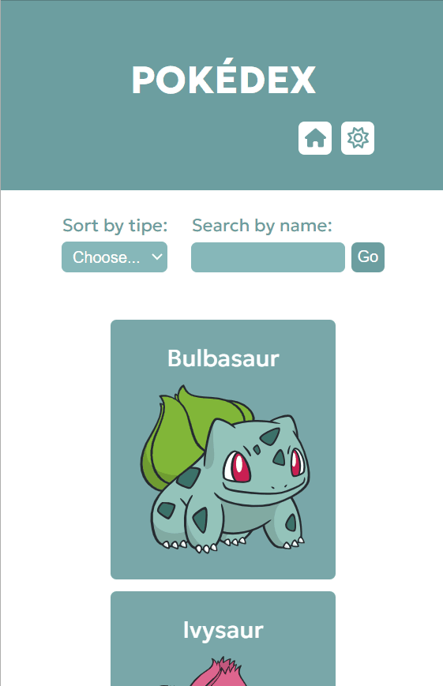

<h1>Pokédex - Pokémon API Challenge - built with React</h1>

This is a responsive Single Page Application built using React and Styled Components that consumes an API. The project was built in response to a challenge proposed by the fullstack web development course Devquest by <a href="https://github.com/devemdobro">Dev em Dobro</a>.

<h2>Overview</h2>

<h3>The project</h3>

The application provides a list of Pokémons. In order to see more Pokémons, user can click on "Load more" and new Pokémons are added to the list. By clicking on a Pokémon, user can see it's details such as moves, abilities and types. It is also possible to sort Pokémons by type or search by name. If an invalid name is entered, an error message appears on screen.

<h3>Preview</h3>
<h4>Desktop</h4>

<h4>Tablet</h4>

<h4>Mobile</h4>

<h3>How to use the project</h3>
<ul>
    <li>Clone the project:</li>
        Option 1: git clone
        <ul>
            <li>Open the folder in your computer where you want to store the project;</li>
            <li>Open terminal in this folder;</li>
            <li>Paste the following command in the terminal and hit enter:  
                <b>git clone https://github.com/julianastahelin/pokemon-api-challenge.git</b>
            </li>
            <li>Once it is done running, enter the project folder created:  
                <b>cd pokemon-api-challenge</b>
            </li>
        </ul>
        Option 2: download files
        <ul>
            <li>Click on "Clone" and then on "Download ZIP";</li>
            <li>Open folder in your computer and click to Extract all files;</li>
            <li>Open folder with files extracted and open the terminal inside that folder.</li>
        </ul>
    <li>Then, enter the following command to install the project dependencies:  
        <b>npm install</b>
    </li>
    <li>Then, start the application in the local server:  
         <b>npm start</b>
    </li>
    <li>Open folder in the text editor of your choice.</li>
</ul>
    

<h3>Links</h3>
<ul>
    <li>Live site URL: <a href="https://pokemon-api-challenge-seven.vercel.app/">https://pokemon-api-challenge-seven.vercel.app/</a></li>
    <li>Pokémon API documentation: <a href="https://pokeapi.co/">https://pokeapi.co/</a></li>
</ul>

<h2>My process</h2>

<h3>Built with 👩🏽‍💻</h3>
<ul>
    <li>React.js;</li>
    <li>Styled components;</li>
    <li>CSS.</li>
</ul>

<h3>Tools used and technical decisions</h3>
<ul>
    <li>React-icons: I chose to use react-icons because it has a wide range of icon libraries, it is easy to install and use and I can only import the icons that will be used.</li>
    <li>useNavigate hook from react-router-dom: used to navigate to a new route when sort by type component has an option selected; it is a tool I found to connect one component to another using the hook and changing the url at the same time. The "Choose..." option (which is equivalent to removing the filter), I've set to navigate to the homepage, where all types are displayed by default, and there is no need for a unique url. In this case, since I couldn't figure out how to pass on the string 'pokemon' from the filter component's state as a prop to the homepage route, but only as part of the path, I decided to use an if-else statement in the pokémon list component to check if the string passed on is undefined, which happens when 'Choose...' option is selected. If so, it changes to 'pokemon' and all types are rendered.</li>
</ul>

<h3>What I practiced 💪🏽</h3>
<ul>
    <li>Building React components;</li>
    <li>Using React hooks: useState, useEffect, useContext, useRef;</li>
    <li>Using Context API;</li>
    <li>Fetching data from an API;</li>
    <li>Using React Router to build the routes in the Single Page Application;</li>
    <li>Styling with Styled components;</li>
    <li>Passing parameters from parent to child and from child to parent components;</li>
    <li>Using Icons in React.</li>
</ul>