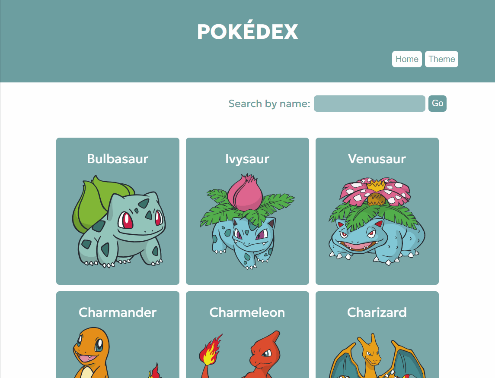
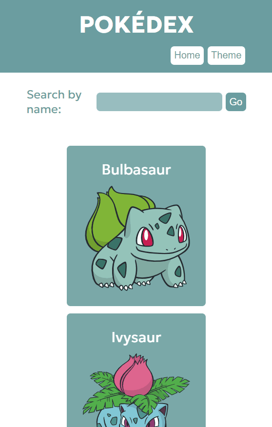

<h1>Pokédex - Pokémon API Challenge - built with React</h1>

This is a responsive Single Page Application built using React and Styled Components that consumes an API. The project was built in response to a challenge proposed by the fullstack web development course Devquest by <a href="https://github.com/devemdobro">Dev em Dobro</a>.

<h2>Overview</h2>

<h3>The project</h3>

The application provides a list of Pokémons. In order to see more Pokémons, user can click on "Load more" and new Pokémons are added to the list. By clicking on a Pokémon, user can see it's details such as moves, abilities and types. It is also possible to search Pokémons by name. If an invalid name is entered, an error message appears on screen. 

<h3>Preview</h3>
<h4>Desktop</h4>

<h4>Tablet</h4>

<h4>Mobile</h4>

<h3>Links</h3>
<ul>
    <li>Live site URL: </li>
    <li>Pokémon API documentation: <a href="https://pokeapi.co/">https://pokeapi.co/</a></li>
</ul>

<h2>My process</h2>

<h3>Built with 👩🏽‍💻</h3>
<ul>
    <li>React.js</li>
    <li>Styled components</li>
</ul>

<h3>What I practiced 💪🏽</h3>
<ul>
    <li>Building React components;</li>
    <li>Using React hooks: useState, useEffect, useContext;</li>
    <li>Using Context API;</li>
    <li>Using React Router to build the routes in the Single Page Application;</li>
    <li>Styling with Styled components.</li>
</ul>